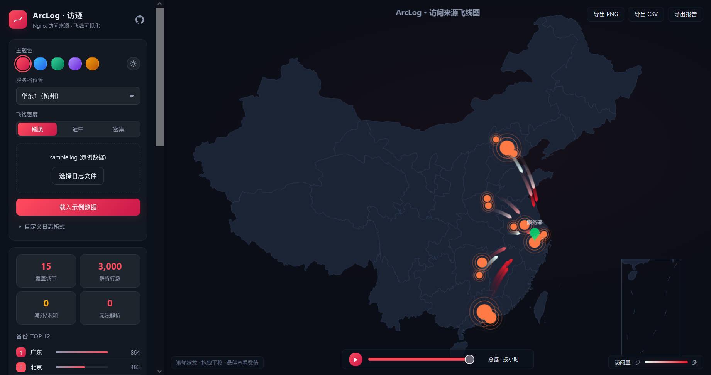
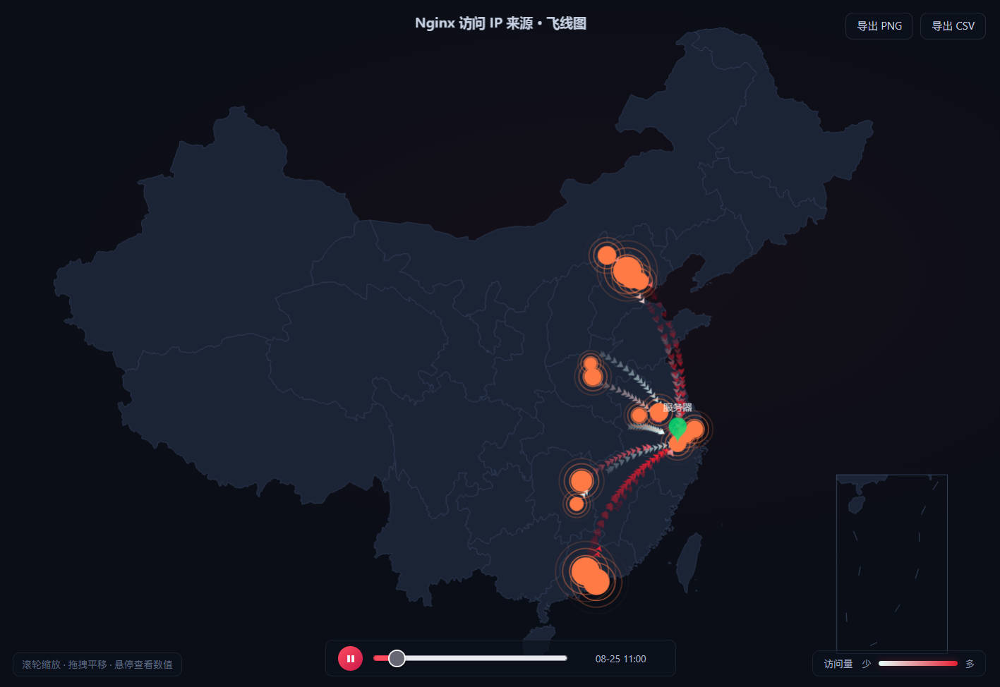
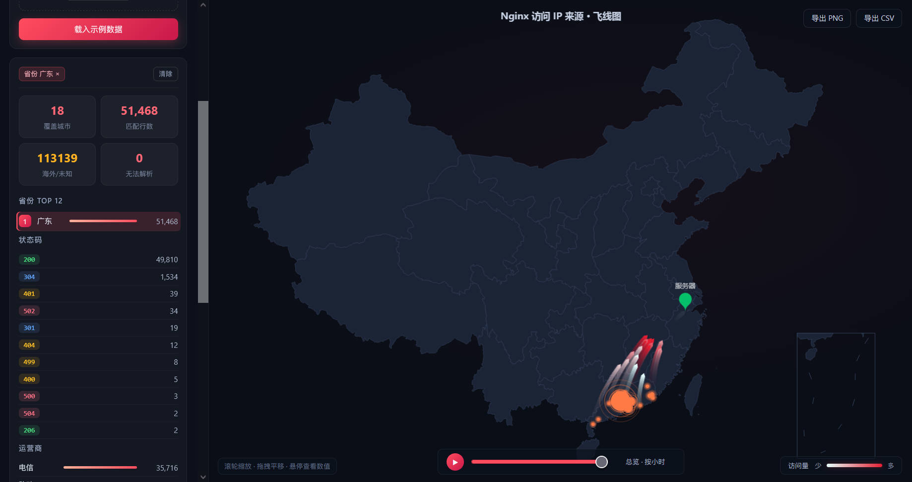
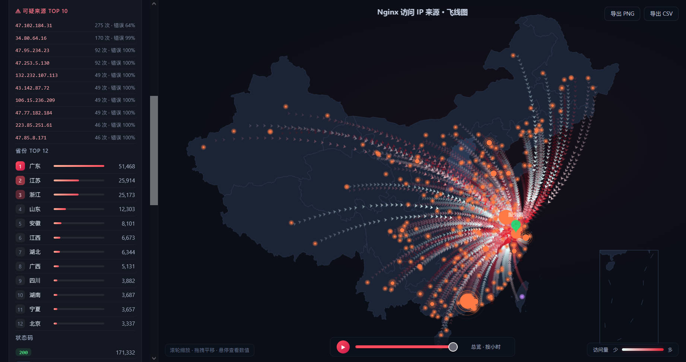

# ArcLog · 访迹

本地分析 nginx 日志、在 2D 中国地图上以**飞线**展示访问来源的可视化工具。纯前端实现，零后端、零外部请求，数据不出本机。

> **ArcLog** = Access **Log** + **Arc**（飞线弧线）—— 看你的访客从哪里来，如何"飞"到你的服务器。


## [预览](https://kevinvane.github.io/ArcLog)

<!-- 截图占位: 将图片放入 docs/screenshots/ 目录, 保持以下文件名即可显示 -->
| 飞线总览 | 时间轴回放 |
| --- | --- |
|  |  |

| 过滤联动 | 可疑来源 |
| --- | --- |
|  |  |

> [在线试用](https://kevinvane.github.io/ArcLog)

## 功能特性

| 功能 | 说明 |
| --- | --- |
|  **城市级飞线地图** | 拖入 `access.log` 或者 `access.log.gz` 即可查看各城市 → 服务器的飞线，5 级粗细/白红渐变/光晕表达流量层级 |
|  **时间轴回放** | 自动按小时/天分桶，播放按钮逐时段回放流量演化（回放时飞线动画周期自适应） |
|  **多维过滤联动** | 点击状态码 / 省份行 / 运营商行组合筛选，地图与全部统计实时联动 |
|  **安全视角** | 自动识别可疑 IP（高频 + 高错误率）与异常省份，地图紫色预警点标示 |
|  **统计面板** | 右侧独立栏：省份 Top 12、城市覆盖数、状态码、运营商/客户端占比、路径 Top 10，双列排布且各分区可折叠 |
|  **自适应布局** | 左「配置」+ 右「统计」双栏；统计栏可收起为竖标签条，窄屏自动转为浮层抽屉，地图叠加元素同步避让 |
|  **报告导出** | 一键导出地图 PNG 快照（2x）与完整统计 CSV（含 BOM，Excel 直开） |
|  **主题切换** | 5 种强调色（曜石红 / 深海蓝 / 极光绿 / 落日紫 / 琥珀橙）× 昼夜双模式，UI 与地图配色整体切换，选择本地持久化 |
|  **纯前端架构** | 解析 + IP 定位 + 聚合全部运行在 Web Worker，大日志不卡 UI，带实时进度 |

## 环境要求

| 依赖 | 最低版本 | 说明 |
| --- | --- | --- |
| Node.js | 18.0+ | 开发/构建需要；仅使用构建产物（`dist/`）则无需安装 |
| npm | 9.0+ | 随 Node.js 附带 |
| 浏览器 | 见下方 | 运行时需支持 ES Module Worker |

支持的浏览器：Chrome / Edge 80+、Firefox 114+、Safari 15+

## 快速开始

```bash
git clone https://github.com/kevinvane/ArcLog.git
cd ArcLog
npm install
npm run dev        # 开发模式, 浏览器打开 http://127.0.0.1:5173/
npm run build      # 生产构建 → dist/ (可部署到任意静态服务器)
npm run preview    # 本地预览构建产物
```

> 首次进入页面会自动加载 11MB 的 IP 数据库，请稍候片刻（拖拽区会显示"IP 数据库加载中…"）。

### 使用方式

1. 将 nginx `access.log` 拖入左侧拖拽区（支持 combined 格式），或点击「载入示例数据」预览效果；
2. 下拉选择服务器所在地域（内置阿里云 12 个地域：华北1青岛 ~ 西南1成都、中国香港），飞线终点即时切换；
3. 调整「飞线密度」（稀疏 / 适中 / 密集）控制视觉疏密；
4. 点击状态码、省份、运营商可组合过滤；点击 ▶ 回放流量时间演化；
5. 地图右上角「导出 PNG / CSV」生成报告；
6. 右侧统计栏可收起：点标题栏 `›` 收起为竖排「统计」标签，点击标签重新展开；各维度标题可点击折叠，列表超过 6 条时可展开剩余项。

## 技术架构

```
access.log
  └─ parseLog.ts       正则解析 IP / 状态码 / 路径 / 时间戳
       └─ ip2region.ts 自研 xdb 二进制解析器(纯 JS, 二分查找)
            └─ analyze.ts   多维聚合: 城市×过滤×时间轴×可疑检测
                 └─ App.vue ECharts geo + lines(飞线) + effectScatter(涟漪)
```

以上全流程运行在 **Web Worker** 中，主线程只负责渲染与交互。

### 为什么自研 xdb 解析器？

官方 `ip2region` npm 包依赖 Node 的 `fs` 模块，无法在浏览器运行。xdb v4 格式
（256B Header + 14B 段索引，小端字节序）实现简单，因此直接手写了约 130 行的
纯 JS 读取器——完全离线、零依赖，且对损坏文件有完整的边界校验。

### 关键设计

- **IP 定位**：[ip2region](https://github.com/lionsoul2014/ip2region) 离线数据库（`public/data/ip2region.xdb`，11MB），国内精确到市
- **坐标映射**：城市坐标表来自阿里云 DataV 公开行政区划数据（363 个地级市）；直辖市等无地级市条目的自动回退省中心
- **流量分级**：按排名 quantile 分成 5 级，任何数据分布下视觉层级都清晰（不受"一家独大"影响）
- **确定性抖动**：多股飞线起点偏移由城市名 hash 决定，重算时线束位置稳定不跳变

## 目录结构

```
├─ public/data/ip2region.xdb   # IP 离线数据库 (11MB, 运行必需)
├─ docs/
│  ├─ 方案总结.md              # 技术方案文档
│  └─ 优化路线图.md            # 迭代记录与技术债
└─ src/
   ├─ main.ts                  # 入口: 注册 ECharts 组件与中国地图
   ├─ App.vue                  # 主界面: 左栏配置 / 地图 / 右栏统计(可折叠) / 时间轴
   ├─ worker/
   │  └─ analyzer.worker.ts    # Web Worker: 解析+定位+聚合
   ├─ utils/
   │  ├─ ip2region.ts          # 自研 xdb 解析器
   │  ├─ parseLog.ts           # nginx 日志解析
   │  ├─ analyze.ts            # 聚合统计引擎
   │  └─ geo.ts                # 省市别名/坐标/地域配置
   └─ assets/
      ├─ china.json            # 中国省级 GeoJSON (ECharts 底图)
      └─ china-cities.json     # 363 城市坐标表
```

## 注意事项

- **日志格式**：优先适配 combined 格式（含 `$time_local` 才能启用时间轴回放）；非标准格式的行退化为仅提取首个字段作为 IP
- **海外 IP**：不计入飞线（中国地图无对应坐标），在侧栏「海外/未知归属」卡片中计数
- **隐私**：所有解析在本机浏览器完成，不上传任何数据
- **浏览器要求**：需支持 ES Module Worker（Chrome 80+ / Edge 80+ / Firefox 114+ / Safari 15+）
- **布局自适应**：右栏统计在窗口 ≥1800px 时默认展开，1280~1800px 默认收起为竖标签条，<1280px 改为浮层抽屉；手动切换后记住选择（存于 localStorage `arclog-statbar`）
- **数据库时效**：IP 库随仓库提供，数据会随时间老化；可从 [ip2region 官方仓库](https://github.com/lionsoul2014/ip2region/releases) 下载最新 `ip2region_v4.xdb` 覆盖 `public/data/ip2region.xdb`

## 相关文档

- [技术方案总结](docs/方案总结.md)
- [优化路线图](docs/优化路线图.md)

## 已知限制

- GB 级超大日志建议先切分（当前为内存全量处理，百 MB 级体验良好）
- 时间轴跨度超过约 4 年时自动停用（超出小时/天粒度的桶数上限）
- 海外 IP 无城市级定位，如需全球视图需引入世界地图与 GeoLite2

## License

MIT
